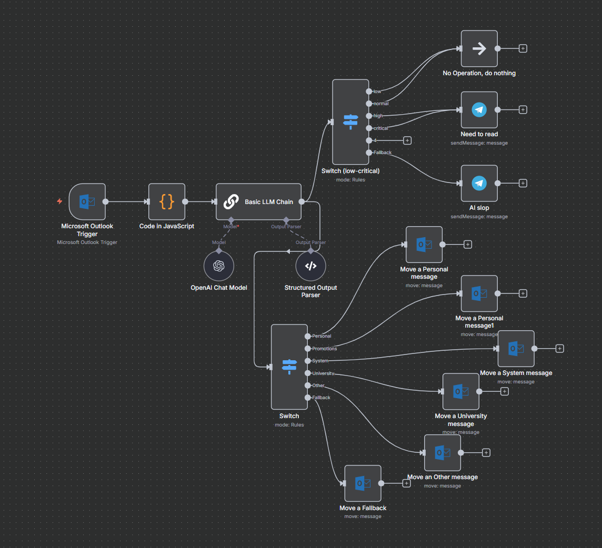

# Outlook Triage with n8n + LLM

📧 An **AI-powered email triage system** built in [n8n](https://n8n.io) that:
- Reads emails from Microsoft Outlook.
- Uses an LLM (OpenAI) to classify messages (Promotions, Personal, University, System, etc.).
- Decides whether to notify the user via Telegram.
- Moves messages into the correct folders automatically.

<p align="center">
  
</p>

---

## 🚀 Features
- **Smart classification** with OpenAI (configurable prompt).
- **Multi-label output**: e.g. an email can be both `University` and `System`.
- **Custom priority levels**: low, normal, critical.
- **Telegram notifications** only for important messages.
- **Configurable strictness**:
  - Adjust the **LLM prompt** in [`prompts/classifier.md`](prompts/classifier.md).
  - Or simply **re-wire nodes** in the final switch (e.g., send fewer/more cases to Telegram).

---

## 📂 Repository Structure
```

.
├── docs/
│   └── flow\.png                # Workflow diagram
├── prompts/
│   └── classifier.md           # LLM classification prompt
├── samples/                    # Example data
│   ├── inbox/                  # Raw Outlook trigger outputs (anonymized)
│   ├── classifier\_outputs/     # JSON outputs from LLM classification
│   └── telegram\_previews/      # Telegram messages that would be sent
├── workflows/
│   └── outlook-filter-public.json  # n8n workflow (sanitized)
├── .env.example                # Example environment configuration
├── .gitignore
├── docker-compose.yml
├── LICENSE
└── README.md

````

---

## ⚙️ Setup

This workflow was built and tested on a **self-hosted n8n server**.  
You can run it the same way locally with Docker or import the workflow file directly into an existing n8n instance.

### Option 1: Run with Docker (recommended)
```bash
docker-compose up -d
````

n8n will start on [http://localhost:5678](http://localhost:5678).
Log in with the default credentials (set in `docker-compose.yml`).

### Option 2: Import into existing n8n

* Open your local n8n UI.
* Import [`workflows/outlook-filter-public.json`](workflows/outlook-filter-public.json).
* Configure credentials in `.env`.

---

## 🔑 Environment Configuration

Copy `.env.example` → `.env` and fill in your credentials:

```bash
cp .env.example .env
```

Required keys:

* `OPENAI_API_KEY` — your OpenAI API key
* `OUTLOOK_CLIENT_ID`, `OUTLOOK_TENANT_ID`, `OUTLOOK_CLIENT_SECRET`, `OUTLOOK_REFRESH_TOKEN` — from your Azure App
* `TELEGRAM_BOT_TOKEN`, `TELEGRAM_CHAT_ID` — for Telegram integration

Optional:

* `OUTLOOK_FOLDER_ID` — custom inbox folder (default: `Inbox`)
* `ALERT_THRESHOLD` — minimum priority to trigger Telegram
* `DEMO_MODE` — set `true` to run with sample data

---

## 🧪 Demo Mode

If you don’t want to connect to Outlook yet, set:

```bash
DEMO_MODE=true
```

This allows you to experiment with the example files in `samples/`:

* Input emails: `samples/inbox/*.json`
* Classifier outputs: `samples/classifier_outputs/*.json`
* Telegram previews: `samples/telegram_previews/*.txt`

---

## 📖 Examples

### Example 1 — Promotion

* **Input:** [`promo_1.anonymized.json`](samples/inbox/promo_1.anonymized.json)
* **Classifier Output:** [`promo_1.json`](samples/classifier_outputs/promo_1.json)
* **Telegram:** none (low priority, just moved to Promotions)

### Example 2 — Personal

* **Input:** [`personal_2.anonymized.json`](samples/inbox/personal_2.anonymized.json)
* **Classifier Output:** [`personal_2.json`](samples/classifier_outputs/personal_2.json)
* **Telegram Preview:** [`personal_2.txt`](samples/telegram_previews/personal_2.txt)

### Example 3 — University (Normal)

* **Input:** [`university_3.anonymized.json`](samples/inbox/university_3.anonymized.json)
* **Classifier Output:** [`university_3.json`](samples/classifier_outputs/university_3.json)
* **Telegram:** none (normal priority, just sorted)

### Example 4 — University (Critical)

* **Input:** [`university_4.anonymized.json`](samples/inbox/university_4.anonymized.json)
* **Classifier Output:** [`university_4.json`](samples/classifier_outputs/university_4.json)
* **Telegram Preview:** [`university_4.txt`](samples/telegram_previews/university_4.txt)

---

## 🛠️ Customization

* **Change classification behavior**: edit [`prompts/classifier.md`](prompts/classifier.md).
* **Adjust notification strictness**: in the final switch node of the n8n workflow (`workflows/outlook-filter-public.json`), change which branches trigger Telegram alerts.

---

## 📜 License

This project is licensed under the MIT License – see the [LICENSE](LICENSE) file for details.
